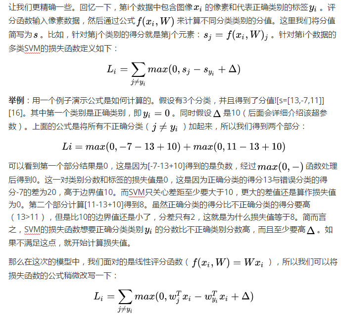

## 多类支持向量机损失 Multiclass Support Vector Machine Loss

## 正则化

* L2范式通过对所有参数进行逐元素的平方惩罚来抑制大数值的权重
* 其中最好的性质就是对大数值权重进行惩罚，可以提升其泛化能力，因为这就意味着没有哪个维度能够独自对于整体分值有过大的影响。L2惩罚倾向于更小更分散的权重向量，这就会鼓励分类器最终将所有维度上的特征都用起来，而不是强烈依赖其中少数几个维度。
* 设置Delta：你可能注意到上面的内容对超参数delta及其设置是一笔带过，那么它应该被设置成什么值？需要通过交叉验证来求得吗？现在看来，该超参数delta=1.0在绝大多数情况下设为都是安全的。超参数delta和lamda看起来是两个不同的超参数，但实际上他们一起控制同一个权衡：即损失函数中的数据损失和正则化损失之间的权衡。理解这一点的关键是要知道，W权重的大小对于分类分值有直接影响（当然对他们的差异也有直接影响）：当我们将W中值缩小，分类分值之间的差异也变小，反之亦然。因此，不同分类分值之间的边界的具体值（比如delta=1或delta=100）从某些角度来看是没意义的，因为权重自己就可以控制差异变大和缩小。也就是说，真正的权衡是我们允许权重能够变大到何种程度（通过正则化强度lamda来控制）。