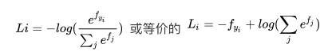
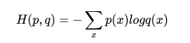
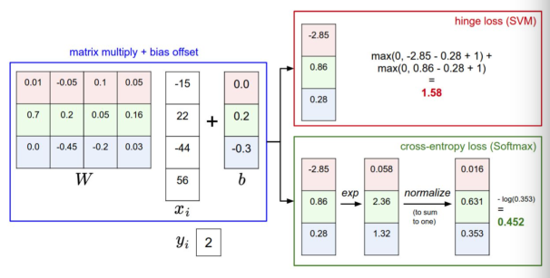

## softmax分类器

* SVM 将f(X, W)作为分类的评分（因为无定标，所以难以直接解释）

* Softmax将这些评分值视为每个分类的未归一化的对数概率，并且将折叶损失（hinge loss）替换为交叉熵损失（cross-entropy loss

* softmax 函数：其输入值是一个向量，向量中元素为任意实数的评分值，函数对其进行压缩，输出一个向量，其中每个元素值在0到1之间，且所有元素之和为1。

* 从不同视角进行解释
    * 信息理论视角：在"真实"分布p和估计分布q之间的交叉熵定义如下:

    

    因此，Softmax分类器所做的就是最小化在估计分类概率（就是上面的）和"真实"分布之间的交叉熵

    * 概率论视角：可以解释为是给定图像数据X，以W为参数，分配给正确分类标签y_i的归一化概率。从概率论的角度来理解，我们就是在最小化正确分类的负对数概率，这可以看做是在进行最大似然估计（MLE）。该解释的另一个好处是，损失函数中的正则化部分可以被看做是权重矩阵的高斯先验，这里进行的是最大后验估计（MAP）而不是最大似然估计。

* SVM v.s. Softmax

    * 两个分类器都计算了同样的分值向量f（本节中是通过矩阵乘来实现）。不同之处在于对f中分值的解释：SVM分类器将它们看做是分类评分，它的损失函数鼓励正确的分类（本例中是蓝色的类别2）的分值比其他分类的分值高出至少一个边界值。Softmax分类器将这些数值看做是每个分类没有归一化的对数概率，鼓励正确分类的归一化的对数概率变高，其余的变低。SVM的最终的损失值是1.58，Softmax的最终的损失值是0.452，但要注意这两个数值没有可比性。只在给定同样数据，在同样的分类器的损失值计算中，它们才有意义。

    * 现在，如果正则化参数λ更大，那么权重W就会被惩罚的更多，然后他的权重数值就会更小。随着正则化参数λ不断增强，权重数值会越来越小，最后输出的概率会接近于均匀分布。这就是说，softmax分类器算出来的概率最好是看成一种对于分类正确性的自信。和SVM一样，数字间相互比较得出的大小顺序是可以解释的，但其绝对值则难以直观解释。

    * 考虑一个评分是[10, -2, 3]的数据，其中第一个分类是正确的。那么一个SVM（）会看到正确分类相较于不正确分类，已经得到了比边界值还要高的分数，它就会认为损失值是0。SVM对于数字个体的细节是不关心的：如果分数是[10, -100, -100]或者[10, 9, 9]，对于SVM来说没设么不同，只要满足超过边界值等于1，那么损失值就等于0。对于softmax分类器，情况则不同。对于[10, 9, 9]来说，计算出的损失值就远远高于[10, -100, -100]的。换句话来说，softmax分类器对于分数是永远不会满意的：正确分类总能得到更高的可能性，错误分类总能得到更低的可能性，损失值总是能够更小。但是，SVM只要边界值被满足了就满意了，不会超过限制去细微地操作具体分数.
